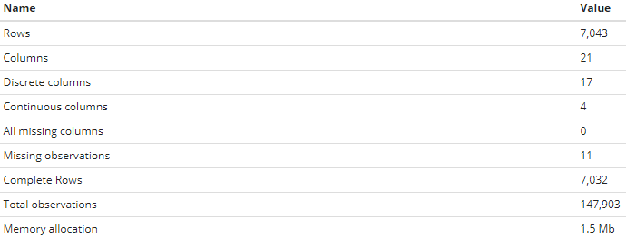
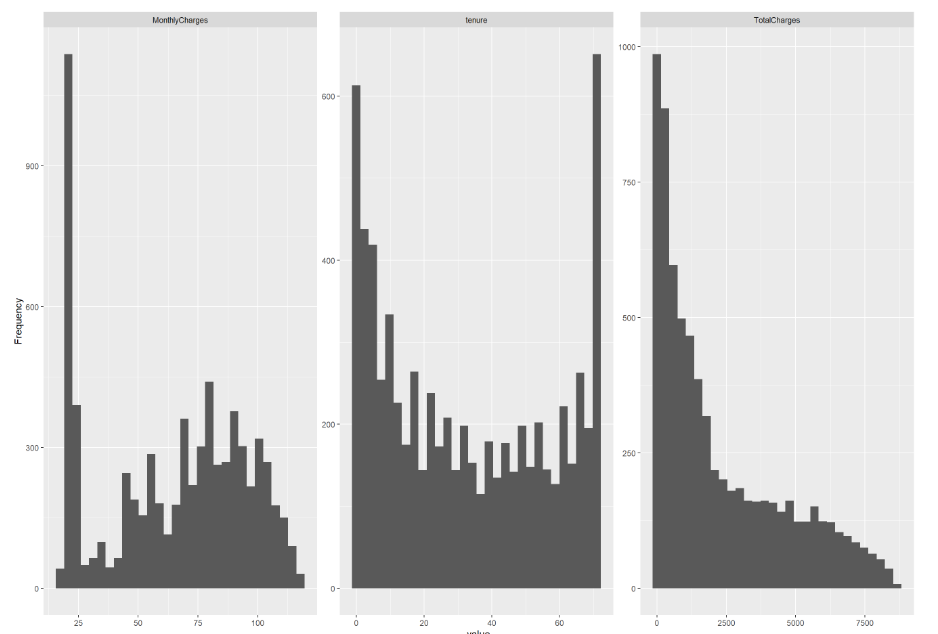
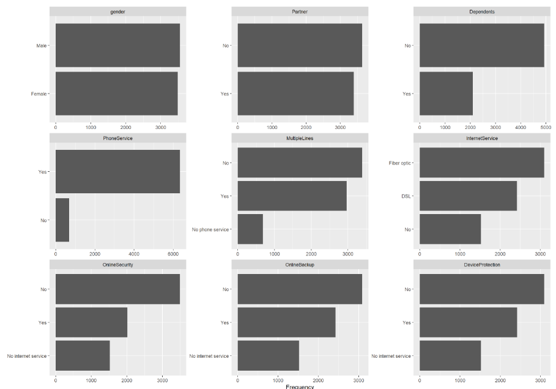
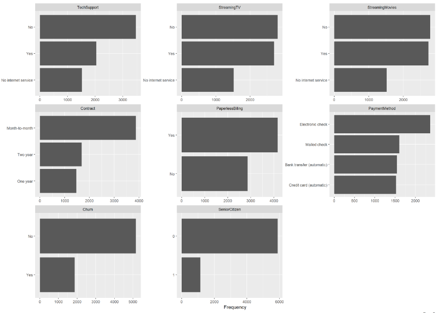
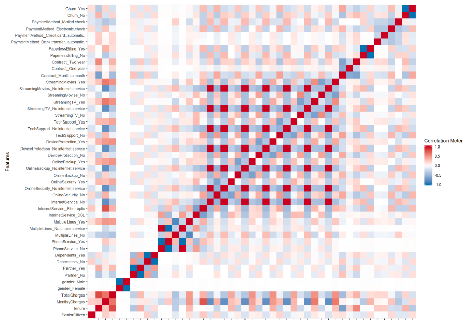

```{r setup, include=FALSE}
knitr::opts_chunk$set(echo = TRUE)
library(ggplot2)
library(corrplot)
library(tidyverse)
library(RColorBrewer)
library(dplyr)
```

\newpage

# Descripción del conjunto de datos

```{r}
fdata <- read.table(file = 'data/Telco-Customer-Churn.csv', sep= ',', header = TRUE, na.strings = 'NA', stringsAsFactors = FALSE)
#library(DataExplorer)
#DataExplorer::create_report(fdata) #Este paquete se ha ejecutado antes de realizar este informe para sacar de forma automática un análisis exploratorio básico del set de datos para obtener imágenes utilizadas durante este informe.
```

 El set de datos a tratar contiene información de clientes de un Proveedor de servicois de telecomunicaciones tales como telefonía, Internet... De forma muy básica, el set de datos tiene la siguiente estructura:
  
   
 
  El set de datos contiene información tal como información personal del cliente, los servicios que tiene contratados o los gastos que éstos le generan.
 Las variables de este conjunto de datos son:  
 
 * customerID -> Customer ID
 * gender -> Género del cliente
 * SeniorCitizen -> Indicador de si el cliente está jubilado
 * Partner -> Indicador de si el cliente tiene pareja
 * Dependents -> Indicador de si el cliente tiene a otros a su cargo
 * tenure -> Número de meses que el cliente ha estado en la compañía
 * PhoneService -> Indicador de si el cliente tiene el servicio de telefonía
 * MultipleLines -> Indicador de si el cliente tiene múltiples líneas de telefonía (Yes, No, No phone service)
 * InternetService -> Tipo de servicio de Internet contratado (DSL, Fiber optic, No)
 * OnlineSecurity -> Indicador de si el cliente tiene contratado un servicio de Seguridad (Yes, No, No internet service)
 * OnlineBackup -> Indicador de si el cliente tiene contratado un servicio de Backup (Yes, No, No internet service)
 * DeviceProtection -> Indicador de si el cliente tiene contratado un servicio de protección del dispositivo (Yes, No, No internet service)
 * TechSupport -> Indicador de si el cliente tiene contratado el servicio técnico (Yes, No, No internet service)
 * StreamingTV -> Indicador de si el cliente tiene contratado un servicio de Streaming TV (Yes, No, No internet service)
 * StreamingMovies -> Indicador de si el cliente tiene contratado un servicio de películas (Yes, No, No internet service)
 * Contract -> Tipo de contrato del cliente (Month-to-month, One year, Two year)
 * PaperlessBilling -> Indicador de si el cliente tiene factura electrónica (Yes, No)
 * PaymentMethod -> Modo de pago del cliente (Electronic check, Mailed check, Bank transfer (automatic), Credit card (automatic))
 * MonthlyCharges -> Cargo mensual
 * TotalCharges -> Pago total del cliente durante su contrato
 * Churn -> Indicador de si el cliente ha abandonado la compañía (Yes or No)

```{r echo=TRUE, tidy=TRUE}
summary(fdata)
```

```{r}
dim(fdata)
```
 De esta forma, contamos con un set de datos de 7043 filas y 21 columnas.
 
 Coprobemos si hay nulos en el set de datos:
 
```{r}
all(complete.cases(fdata))
```
 Tenemos valores nulos, que los eliminaremos más adelante para tener el set de datos lo más limpio posible.
 
\newpage

# Primer análisis de las variables

 El primer paso realizado anterior al análisis de las variables ha sido el filtrado de éstas. Se ha eliminado la columna 'customerID' dado que cada valor es único para cada cliente y no tiene ninguna utilidad. Además se filtrarán aquellas filas en las que falten valores, para tener los datos con la mejor estructura posible. 
 Por otro lado, vamos a aplicar la función *as.factor()* en las columnas de valor discreto para trabajar con éstas.
 
```{r}
fdata = fdata[,2:21]
fdata[,c(1,2,3,4,6,7,8,9,10,11,12,13,14,15,16,17,20)] = lapply(fdata[c(1,2,3,4,6,7,8,9,10,11,12,13,14,15,16,17,20)], factor)
```

 También eliminaremos las filas con valores nulos para trabajar con un set más limpio.

```{r}
fdata <-fdata[complete.cases(fdata), ]
dim(fdata)
```
 Quedándonos ya con un set de datos sin ningúna fila con nulos y con 7032 filas. Solamente hemos perdido 11 filas en este proceso.

 Antes de comenzar con el análisis de las variables, veamos por encima unos ejemplos de cómo son estas variables tras el cambio:
```{r}
glimpse(fdata)
```
 
 El set de variables consta de dos tipos principales: Variables continuas (tenure, MonthlyCharges, TotalCharges) y discretas, por lo que tendremos que considerar esta estructura a la hora de trabajar con el conjunto de datos.
 
   

   
  
   

 Para conocer la relación entre variables se ha representado de forma gráfica las correlaciones entre ellas:

   

 Se observa que hay muy poca relación entre las variables, de forma que cada una de ellas asemejan ser suficientemente representativas e importantes para definir las distintas características de cada uno de los clientes.
 
 *La mayoría de las variables que tienen correlación '1' fuera de la diagonal principal son dependientes entre ellas (por ejemplo, el par de variables [MultipleLines_NoPhoneService; PhoneService_No]).
 
\newpage 
 
# Análisis sobre el set de datos

 Tras realizar un estudio exploratorio de nuestras variables del set de datos, procederemos a estudiar el set de datos de distintas formas para poder extraer información relevante sobre los mismos y de esta forma adquirir un conocimiento valioso para la toma de decisiones futura sobre los clientes.

## Análisis de 1 variable - Contratos de los clientes

 Empecemos el análisis del set de datos analizando la variable del **Tipo de Contrato** (Contract). Queremos conocer distintas probabilidades sobre estos tipos de clientes. Primero vamos a ver la distribución de esta variable:

```{r}
prop.table(table(fdata$Contract))
```
 
 Vemos que más del 55% del total de los clientes tienen contratos del tipo *Mes-a-mes*.

 Ahora supongamos que una compañía de la competencia que únicamente ofrece contratos **Anuales** quisiera llamar a alguno de nuestros clientes para hacerles una oferta. Queremos conocer cuál es la probabilidad de que al llamar a nuestros clientes solamente sea capaz de captar a 3 o menos clientes con este tipo de contrato si de todas sus llamadas 15 sean a clientes nuestros.
 
 Para conseguir este propósito, plantearemos una distribución binomial como la planteada a continuación:

```{r}
pbinom(3, size = 15, prob = 0.2091)
```
 
 y con el resultado mostrado vemos que la probabilidad de que únicamente 3 o menos sean contactados es del 61.4%.

\newpage

## Relación entre varias variables

 Tras el análisis univariante, vamos a analizar la relación entre varias variables continuas: Primero estudiaremos la **Permanencia** (tenure) y los **Gastos Mensuales** (MonthlyCharges) de los clientes, para conocer la tendencia de estos cuando pasa un tiempo prolongado en la compañía. También analizaremos de forma sencilla el coste de cada **Tipo de Contrato** (Contract) para conocer la diferencia entre estos.
 
### Permanencia y Gasto mensual

 En este apartado estudiaremos la dependencia entre las dos primeras variables, primero de forma gráfica y después de forma analítica utilizando un Contraste de Hipótesis.

```{r}
disp = ggplot(fdata) + 
  geom_point(mapping = aes(x = tenure, y = MonthlyCharges)) + # , color = Contract == 'Month-to-month'
  labs(title="Gasto mensual según la permanencia", 
       x="tenure", y="MonthlyCharges")

disp + 
  geom_smooth(aes(x=tenure,y=MonthlyCharges),method = "lm", fill="red")
```

 Mirando solamente el diagrama de dispersión se ve que están bastante relacionadas, dado que la línea representada no es horizontal. También podemos conocer de forma más 'analítica' si ambas variables están relacionadas utilizando el **Test Chi Cuadrado**.
 
```{r}
chisq.test(fdata$tenure, fdata$MonthlyCharges)
```

  El p-Valor es muy pequeño por lo que se rechaza H0, siendo esta que son independientes. Hay relación entre la permanencia de un cliente y lo que paga al mes; en concreto, cuantos más meses está un cliente, más paga al mes, lo que puede significar que los clientes tienden o a mantener sus contratos (aunque sean altos) dado que los servicios les convencen, o que los van aumentando cuanto más tiempo lleven en la compañía.

\newpage
  
### Gasto Mensual según el Tipo de Contrato

  Por otro lado, también nos interesa hacer una relación entre los contatos de distinta duración y lo que pagan al mes. Sobre este tipo de clientes de mes a mes queremos conocer si en la compañía este tipo de contratos suponen un beneficio mayor a la media de todos los ingresos al mes considerando el resto de contratos.
 
```{r}
fdata %>% 
  group_by(Contract) %>%
  summarise(media = mean(MonthlyCharges))
```

 La media de ingresos por los contratos *Mes-a-mes* es mayor al del resto de contratos. Observar que esta media descienda según aumentemos en la duración de los contratos es de esperar, dado que normalmente ofrecer contratos más duraderos te asegura mantener ingresos durante más tiempo y, por ende, permite ofrecer un mejor precio.

\newpage

## Análisis de un subgrupo de variables - Clientes de fibra de un año de contrato

 Nos interesa filtrar ahora sobre un caso en concreto de nuestro set de datos. Vamos a investigar qué características tienen los clientes de **Fibra Óptica** que tienen **Contratos de 1 año** de duración.
 
```{r}
fibra_1anho = fdata %>% 
  filter(InternetService == 'Fiber optic') %>%
  filter(Contract == 'One year')

dim(fibra_1anho)
```

 Primero nos interesaremos en la diferencia del coste de los contratos entre la gente que vive sola y la que vive con más gente. ¿Apreciaremos un aumento considerable en el coste de estos contratos?

```{r}
ggplot(fibra_1anho, aes(x = Partner, y = MonthlyCharges)) +
  geom_boxplot(fill = "#4271AE", colour = "#1F3552", alpha = 0.5, outlier.colour = "#1F3552", outlier.shape = 20) +
  scale_x_discrete(name = "Churn") +
  scale_y_continuous(name = "Partner") +
  ggtitle("Gasto mensual de los clientes según si tienen pareja") + 
  theme_minimal()
```

 Como podemos observar en los *Boxplot*, no parece que exista una diferencia considerable entre estos dos casos. Por otro lado, sí que observamos que existen ciertos casos de gente cuyo contrato es muy bajo, generando los **Outliers** en los plots anteriores.
 
 Siguiendo con este caso, también podemos observar la distribución que sigue esta variable:

```{r}
ggplot(fibra_1anho) + 
  geom_density(aes(x=MonthlyCharges)) +
  ggtitle("Gráfico de densidad de los gastos mensuales")
```

Vemos que se genera una distribución asimétrica hacia la derecha, de forma que esta variable no sigue una distribución **Normal**, como podemos demostrar analizando la normalidad de la misma, tanto gráficamente

```{r}
qqnorm(fibra_1anho$MonthlyCharges)
qqline(fibra_1anho$MonthlyCharges)
```

 viendo que los extremos de la representación se alejan de la línea de normalidad, como utilizando el *Test Shapiro**
 
```{r}
shapiro.test(fibra_1anho$MonthlyCharges)
```

 donde el p-valor obtenido del contraste de hipotesis Shapiro demuestra que hay que rechazar H0 (normalidad).

 Por último, sobre este subset generado, vamos a crear una nueva variable ('ChargeType') que divida el set de clientes de fibra en 2: 
 
 * Clientes que paguen más de la media : 'High'
 * Clientes que paguen menos de la media: 'Low'
 
 Para que en un futuro se puedan diferenciar más fácilmente, facilitando acciones como hacerles ofertas para mantener a los que más pagan, premiarles por esto...
 
```{r}
fibra_1anho = fibra_1anho %>% 
  mutate(ChargeType = if_else(MonthlyCharges > mean(fibra_1anho$MonthlyCharges), 'High','Low'))

fibra_1anho$ChargeType = as.factor(fibra_1anho$ChargeType)

prop.table(table(fibra_1anho$ChargeType))
```
 
 Y vemos que hay un mayor número de clientes que pagan por encima de la media (que tiene sentido, visto cómo eran los Boxplot y distribución anteriores, con *Outliers* en los valores bajos y un primer cuartil más largo que el cuarto).
 
 Sobre estos clientes *High-value* queremos conocer con cuanta gente viven (si tienen **Pareja** (Partner) o no y si tienen **Gente a su Cargo** (Dependants)), a la hora de hacerles ofertas, saber si se deben dirigir a personas que viven solas, si viven con niños o no... puesto que la compañía desea ofrecer un *pack de ofertas* genérico para todos, por lo que quieren ver qué combinación es la mayoritaria.
 
 Para esto, veremos las distintas posibilidades en un gráfico de *Mosaico*, con su tabla de frecuencias asociada:

```{r}
fibra_1anho_high = fibra_1anho %>% 
  filter(ChargeType == 'High')

mosaicplot(Partner ~ Dependents, data = fibra_1anho_high,color = "skyblue2",
           border = "chocolate")
addmargins(prop.table(table(fibra_1anho_high$Partner, fibra_1anho_high$Dependents)))
```

 Vemos que el caso mayoritario es, con un 38.15%, las personas que viven en Pareja pero sin más gente a su cargo, por lo que las ofertas podrán dirigirse a un grupo de personas adultas.

\newpage

## Probabilidades Condicionadas - Que un cliente abandone la compañía.

 El hecho de que la compañía ofrezca varios tipos de contrato les hace preocuparse sobre la posibilidad de que un cliente **abandone la compañía** (Churn). Para conocer esto calcularemos las probabilidades condicionales de cada uno de los casos.

 Primero realizaremos una exploración básica como la expuesta en el *mosaico*, en el que se representa la variable del *Contrato* frente a la de *Abandono*
 
```{r echo=FALSE}
mosaicplot(Contract ~ Churn, data = fdata,color = "skyblue2",
           border = "chocolate")
```

 El resultado es esperado; es mucho mayor la probabilidad de que un cliente abandone la compañía en un contrato *Mes-a-mes* que en el resto y, a su vez, esta probabilidad es alta.
 
 Calculemos estas probabilidades para saber cuánto debería la compañía preocuparse:
 
```{r}
fdata %>% 
  count(Churn, Contract) %>%
  group_by(Contract) %>%
  mutate(proporcion = prop.table(n))
```
 
  Con esta tabla de frecuencias relativas, obtenemos que las probabilidades de abandono según el contrato es:
  
  * P(abandono|mes-a-mes): 42.7%
  * P(abandono|1-año): 11.3%
  * P(abandono|2-años): 2.8%
  
  Siendo los casos opuestos el valor complementario del mostrado.
  
  La compañía parece tener un grave problema con los contratos *Mes-a-mes*, dado que casi la mitad de clientes que han tenido este contrato han acabado abandonando la compañía. Aún así también es interesante conocer si esos clientes que abandonan al acabar el mes es porque se aprovechan de que la duración es muy corta o simplemente tienen ese contrato, pero se van tras un **largo tiempo** (tenure) con los servicios contratados.
  
  Para calcular esto, nos quedaremos con los clientes con contrato mes a mes y que sí abandonan la compañía, dividiéndolos en dos subgrupos:
  
  * LLevan más de un año: "Long"
  * Llevan menos de un año: "Short"
  
```{r}
leavers = fdata %>% 
  filter(Contract == 'Month-to-month') %>%
  filter(Churn == 'Yes')
  
leavers$Churn_type <- with(leavers, ifelse(leavers$tenure > 12, 'Short', 'Long'))

leavers %>%
  count(Churn_type, Contract) %>%
  mutate(proporcion = prop.table(n))

```

 Con esta información sabemos que la probabilidad de que un cliente con contrato *Mes-a-mes* que abandonó la compañía lo hubiera hecho llevando menos de un año es:
 
 P(Corta_duración|[mes-a-mes + abandono]): 38.1% (sobre el 42.7% anterior)
 
 Número todavía alto, pero menos preocupante que el casi 43% calculado anteriormente.
 
\newpage
 
# Inferencia estadística

 En este apartado estudiaremos características de una variable o comparativas entre variables mediante el uso de tests de hipótesis. En concreto utilizaremos el **t-test** (test T de Student) para poder sacar conclusiones según los resultados obtenidos.

## Intervalos de confianza de los gastos mensuales

 En la compañía tienen el interés de eliminar los servicios de pago que no se realizan de forma automática, y su principal preocupación es que haya clientes que si les quitan este servicio no se pasen al sistema automático, sino que se den de baja de la compañía. Para esto, quieren cercionarse de que el sistema de pago sí que influye en lo que se paga al mes, y además que lo hace generando un mayor dinero para la compañía que los métodos automáticos.
 
 De esta forma, agrupamos los 4 métodos existentes en 2, como se ha explicado:
 
 * Método automático: *Bank transfer* y *Credit card*
 * Método manual: *Mailed check* y *Electronic check*

La forma de estudiar esta necesidad de la compañía será mediante la realización de dos *t-test* y analizando sus intervalos de confianza, ambos al 95%.

```{r}
auto = c('Bank transfer (automatic)', 'Credit card (automatic)')
manual = c('Mailed check', 'Electronic check')

auto_transfer = fdata %>% 
  filter(PaymentMethod %in% auto)

t.test(auto_transfer$MonthlyCharges)$conf.int

manual_transfer = fdata %>% 
  filter(PaymentMethod %in% manual)

t.test(manual_transfer$MonthlyCharges)$conf.int
```

 Como vemos teniendo el resultado de ambos tests el intervalo generados con los datos de clientes con un sistema de pago automático es **mayor** al de los clientes con un pago manual y además estos intervalos **no se solapan**. De esta forma, podemos recomendar a la compañía seguir con su estrategia de eliminar estos métodos de pago favoreciendo una modernización en este aspecto, además de que de forma genérica los clientes afectados serán los que menos ingresos generan para el ISP.

\newpage

## Comparativa de clientes mediante tests de hipótesis

 Por otro lado, la compañía también estudia no seguir contratando el equipo de servicio técnico que tiene ahora mismo, puesto que consideran que en caso de que los clientes con este servicio no puedan asegurar una permanencia alta no les saldría rentable el coste de contratación del equipo. 
 Desde dentro de la organización han asegurado que en el pasado la media de permanencia de los clientes es de unos 3 años (36 meses), por lo que nuestro estudio se realizará considerando este valor, para ver si para las dos variantes deberíamos quedarnos con el servicio técnico.

```{r}
with_support = fdata %>% 
  filter(TechSupport == 'Yes')

without_support = fdata %>% 
  filter(TechSupport == 'No')

t.test(with_support$tenure, alternative = "greater", mu=36)
t.test(without_support$tenure, alternative = "greater", mu=36)
```

 Los resultados obtenidos son los siguientes:
 
 * Para el caso de clientes con Soporte Técnico, se rechaza la hipótesis nula, siendo la alternativa que la permanencia es mayor
 * Para los clientes sin Soporte Técnico, no se puede rechazar la hipótesis nula
 
 Con esos resultados, parece ser que no solamente los clientes con el servicio contratado tienen una permanencia alta, justificando así a la compañía la contratación del personal de Soprte, sino que además parece ser un factor diferenciador para aumentar la permanencia de los clientes, a diferencia de aquellos que no contrataron este servicio.

\newpage

# Modelo de Regresión linear entre el gasto y la permanencia

 El último paso en este análisis de datos sobre los clientes del ISP será estudiar la posibilidad de hacer un modelo de **Regresión Lineal Simple** en dos dimensiones para responder al siguiente concepto:
 
 > Predecir la **Permanencia** de un cliente según su gasto mensual
 
 Este estudio resulta interesante porque un problema de las compañías es que los clientes nuevos (que la única 'variable' que ellos ven es la del *Coste Mensual*) se queden poco tiempo, de forma que todo el gasto que hacen en la instalación en las casas de los clientes y en el equipo que les tienen que proporcionar (routers, decodificadores...) les genera un gasto considerable en comparación con lo que ingresan.
 
 Lo primero será comrpobar de forma aproximada la dependencia entre las variables.

```{r}
disp = ggplot(fdata) +
  geom_point(aes(x=MonthlyCharges, y=tenure)) +
  labs(title="Permanencia del cliente según su gasto mensual", 
       x="MonthlyCharges", y="tenure")

disp + 
  geom_smooth(aes(x=MonthlyCharges,y=tenure),method = "lm", fill="red")
```

 Vemos que a medida que aumenta el gasto mensual, aumenta el número de meses que se mantiene un cliente en la compañía. Aún así, no se puede poner el precio extremadamente alto porque supondría una grandísima barrera de entrada a potenciales clientes que podría acabar con la empresa.
 
 Ahora observemos el modelo lineal generado con estas variables:

```{r}
(modelo = lm(tenure ~  MonthlyCharges, data=fdata))
```
 
 Se establece la ecuación de una recta
 
 > Y = 0.2014*X + 19.3715
 
 Pero lo que debemos hacer es comprobar si este modelo es válido. La población ha de cumplir ciertas condiciones que se prueban con las siguientes figuras y que se explicarán en orden.

```{r}
plot(modelo)
```

 1. Residuos contra los Valores Predichos: Los puntos deben de estar distribuidos de forma aleatoria y homogénea, pero claramente éste no es el caso, donde los residuos disminuyen claramente a lo largo de la gráfica y su concentración no es la misma.
 2. Normalidad de los residuos: Los residuos deberían seguir una distribución normal, pero no sucede con nuestro modelo.
 3. Gráfico *Scale-Location*: En este gráfico, que se puede utilizar como complemento del primero, también queremos que la distribución de los valores sea uniforme a lo largo de ambos ejes, pero con nuestro modelo no lo conseguimos.
 4. *Leverage* y Distancia de Cook: Este gráfico indica la capacidad de influencia de los puntos. Con este gráfico se mide el efecto de la observación. En nuestro modelo, se ve que los últimos valores son influyentes y hacen palanca.
 
 Con este análisis, vemos que un modelo de regresión lineal simple no es para nada adecuado para estimar los valores de Permanencia utilizando el Coste Mensual que pagan los clientes, por lo que se recomendaría a la compañía utilizar un modelo más complejo o añadir un mayor número de variables para mejorar su funcionamiento.

\newpage

# Conclusión

 Este análisis de datos nos ha permitido conocer más en profundidad nuestro set de datos sobre clientes de un ISP. Aplicando diversos métodos estadísticos hemos obtenido relaciones entre las variables de interés del set, además de su distribución univariante. 
 
 Todos los diversos apartados de este informe han ido respondiendo a cuestiones planteadas al principio de los mismos, aplicando en cada momento una herramienta distinta. La lógica llevada a cabo en cada momento con una o varias variables es extrapolable a otras, pero teniendo en consideración que la forma de trabajar con variables continuas no es la misma que con discretas.
 
 Como conclusión final, un análisis estadístico te permite conocer mejor la realidad que representa la información, y te ayuda a sentar una buena base para la toma de decisiones futura y para el uso de herramientas más potentes para el tratamiento de los datos, como podría ser la clasificación mediante árboles de decisión o la predicción de valores utilizando redes neuronales.
